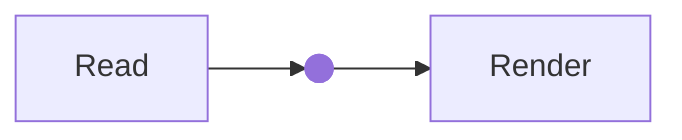

# Local diagrams and GitHub badges

Hugo 0.166.0; **Mermaid 11.17.2** and **drawio viewer 31.5.2**, pinned locally.
No Node/build browser, CDN renderer, editor service, upload, API key or Go plugin.
The normal specimen is `/handbook/reference/diagrams/` in the showcase.

## Mermaid stays a fence

````text

````

No page flag. The language-specific native code hook preserves ordinary code and
source-like examples. Supported rendering scope is **flowchart/graph and gitGraph**,
including the actual f-circ shape syntax, subgraphs, CJK labels and multi-target edges.
All 30 audited fences rendered in the local check; this is not every Mermaid grammar,
label/font combination or visual-parity certification. Ordinary B math remains separate.

### XML-safe multiline labels

The pinned Mermaid 11.17.2 renderer uses root-level **`htmlLabels: false`**, included
in its protected config keys. The older `flowchart.htmlLabels` option alone is
insufficient: some rendering paths prefer the root/default setting and emit HTML
labels. HTML-style `<br>` in returned SVG `foreignObject` is not well-formed XML and
cannot reliably decode in Sidera's inert `img` viewer.

Native SVG text/tspan labels keep authored multiline content without source rewrites,
HTML-label injection, string replacements on SVG, a dependency upgrade or a relaxed
sandbox. Literal `\n`, explicit `<br/>`, literal newlines and Markdown multiline
labels are covered by the regression. This is an internal fixed renderer policy,
not a new page parameter or invitation to pass Mermaid initialization directives.
Thirty original real-use diagrams are checked in both palettes for **valid XML and
successful native image decoding**, not merely for the presence of an `<svg` string.
That stronger assertion fixes a gap in the earlier aggregate source-render check.
All existing grammar/size/security and source-only fallback boundaries remain.

Native fixture/integrity checks:
`python3 tests/check_mermaid_svg.py /absolute/fresh-output-directory`.
Browser verification must additionally decode the SVG and verify multiline text;
a successful parser/render promise alone is not evidence of a displayable diagram.

Optional fence attributes: plain nonblank `caption` and safe `class`/`id`. A caption
is optional: omission shows no generic visible caption, while a localized diagram
label remains for accessibility. To display code only, use a `text` fence. The former
`title` and `disabled` options are removed, not aliases. Do not pass
highlighter options to this diagram hook. Init directives/YAML configuration and other
diagram grammars are rejected by the bounded renderer; use source-only or a separately
reviewed integration rather than enabling trusted source. Limit: 50,000 characters,
500 edges. Raw source is escaped in a native details/pre fallback, never host HTML/JS.

## Native drawio source

```text

```

Named `src` is required; optional plain nonblank `caption` has the same caption/label
behavior as Mermaid. Captions sit below the diagram, centered and styled like normal
image captions; diagrams are horizontally centered when they fit. Popup captions are
also below/centered. For file access without rendering, use a normal Markdown link.
There is no diagram `disabled` option or `title` alias. Only exact
current-page `.drawio` resources: no absolute/parent/dot/encoded/glob paths, URLs,
static/global fallback or arbitrary filesystem access. Missing files/invalid options
fail with shortcode position. Native RelPermalink and full original bytes supply the
source download under dated/base-path/language/mounted-doc routes. Files are never
changed, uploaded or replaced by their rendered image. Resource publication is not
redaction; using an ordinary link instead of a viewer does not make a file private.

The current renderer covers **one uncompressed mxfile page**, up to 1 MB / 2,500 cells,
finite geometry coordinates/dimensions within ±100,000. This matches all 40 stored
sources, which rendered in the local check. Native tables/rows/partial rectangles,
arrows, brackets, waypoints and the needed basic polygon stencil stay available.
No external images/fonts, custom executable stencils, drawio math, compressed pages,
multiple-page/layer UI or arbitrary stencil library downloads are promised. These
unsupported models fail to an error/download fallback; they are not silently converted
to boxes. XML is escaped JSON in a data attribute, not displayed as readable source or
added as XML text to page excerpts. Original downloads retain their native bytes.

**Viewing:** an unframed local SVG image. Small icon-only controls (28px desktop,
localized tooltips/accessible names) float **just above** the image on hover or
keyboard focus. Desktop spacing is unchanged: no row is reserved while hidden. The
panel uses the existing gap and may overlap a little preceding prose while visible,
by user choice. A small hover bridge keeps it reachable from the image. Touch and
modal views use a compact row above the image; touch targets remain 44px.
Zoom in/out/fit, arrow-key panning, native touch scrolling and mouse panning remain.
Inline diagrams have no fixed maximum height: their viewport grows with the displayed
image, including when zoomed. Vertical wheel scrolling therefore continues through
the article instead of a height-limited inner pane. Wide/zoomed images retain local
horizontal scrolling. Expanded dialogs stay bounded by the browser viewport and
scroll internally while the background is locked.
Mermaid's source disclosure and drawio's download are toolbar controls; drawio has no
XML source viewer or persistent editing note.

Both viewport scrollbars reuse the shared content style: slim transparent tracks and
rounded thumbs on hover/focus, including expanded dialogs. Touch keeps the thumb
visible; forced-colors mode retains native controls. This does not change scrolling,
zoom/panning, inline wheel chaining or modal containment. Document/sidebar scrollbar
policies remain separate.

**Large view:** the expand icon opens a native modal at 96vw × 94dvh. It fits/upscales
the image to the available space, supports the same controls and Mermaid source pane,
and closes with Escape, ×, or the backdrop. Controls stay clear of the image. Focus
is contained and restored; page layout/scroll and inline zoom/pan are preserved. The
same canvas/image is moved, not re-rendered or duplicated. Explicit ancestor inversion
is transferred once to the modal canvas and follows palette changes. This is not a
hosted lightbox or full editor. This is a source-driven viewer, not a claim to preserve unused upstream
editing/tooltip/layer features. **Editing:** download the original and edit in your
chosen local diagrams.net application. No online editor button or automatic XML transfer.

### Source colors and transparent canvas

The source can specify shape fills, strokes and text colors; otherwise drawio defaults
apply. Native drawio light/dark adaptation is retained. The viewer now uses the
background restored from the file's `mxGraphModel`, rather than forcing white:

- Missing/empty background, `none` or `transparent`: transparent SVG canvas.
- Explicit background color: passed to the native exporter, including its theme adaptation.
- Shape fills are independent and are not removed to make the canvas transparent.

Transparency reveals the page or any enclosing/inversion-wrapper backdrop; it does
not remove CSS backgrounds around the component. Original files/downloads are unchanged.
The current demo omits a canvas background and therefore exports transparently.
The SVG-in-img viewer and native image downloading remain; the selectable-document
switch is paused, not implemented.

## Safety, loading and composition

One lazily created opaque sandbox per renderer **per page**, with a serialized render
queue, avoids a library instance for every diagram. A diagram is queued near the
viewport; a closed fold does not render until visible. The sandbox has only
`allow-scripts`, no same-origin privilege, popups, navigation or download permission.
Its own CSP denies connections, external images/fonts, child frames and eval. drawio
stencil evaluation/dynamic loading and its otherwise automatic MathJax bootstrap are
explicitly disabled. Mermaid uses strict sanitization and fixed integration settings.

Only source-window-checked messages reach the owned sandbox. Returned SVG is displayed
as an **inert Blob-backed image**, never inserted as HTML into the article. Source,
caption, download and control labels remain native parent HTML. The images expose their
caption-derived alternative labels (localized fallback when omitted); this is not a
screen-reader graph navigator. Supply useful prose descriptions/captions for meaningful
diagrams. Mermaid source and original drawio downloads remain available.

Both palettes and System changes work. An author-marked `invert-when-dark` or
`invert-when-light` ancestor selects a **fixed light renderer palette**: the existing
B filter alone performs that authored inversion. Diagram captions/controls/source chrome
use paired light colors inside that wrapper too, avoiding double-themed unreadable text.
Explicit nested filters still compound.
Unmarked diagrams are renderer-themed, not automatically CSS-inverted. No image analysis.

Use C2 **outer `%`, nested `<`** containers. Mermaid fences need no shortcode notation;
diagramsnet and badge_github are block leaves on their own lines. Existing page-local
trusted-node restoration and one-pass Markdown/math/snippet rendering remain. Native
keys now permit underscore-separated shortcode names for badge_github, without dropping
missing/forged-key checks. Site overrides retain their documented bridge obligations.

The shared shell detects actual rendered Content/HTML Summary before deferred resources.
Plainified card excerpts, plain pages, literal code and ordinary file links request no
diagram libraries. Custom layouts must preserve that shell integration. Libraries and
frames are fingerprinted; manifests validate bundled bytes before publication. Opaque
frames cannot use script SRI without CORS-enabled hosting, so **build-time hashes plus
fingerprinted URLs** are used inside them—not weakened sandbox permissions or a new
server-header prerequisite. The parent controller still has SRI. Frame CSP permits
local scripts and inline vendor styles only; a site CSP must allow its local frames
and Blob images. No global unsafe HTML or unsafe-eval is enabled.

Loading/ready messages are assistive-only, not visible page furniture. Errors remain
visible. No-JS/errors retain Mermaid source or the drawio download, never a raw XML
viewer. Failed input does not poison a later diagram. Missing libraries or a 15-second
wait expose the appropriate fallback;
there is no retry daemon. A stalled third-party renderer is not a universal browser-DoS
sandbox guarantee. The fallback is **not equivalent visual rendering**. Local assets
are needed on the initial visit; there is no service worker/offline-cache promise.

## Automatic GitHub badges

```text

```

Required named string `user`/`repo`; optional string `branch`, booleans `release=false`
and `disabled=false`. Quote numeric account names, e.g. `user="78"`. Names and branch
segments are validated; branch paths and identity query data are URL-encoded, never
interpolated as HTML or executable URLs. Unknown fields/types fail with source position.

Four images: identity, stars, forks, last commit. `release=true` adds latest release
and release date. Branch affects the identity label and last-commit path only. The
repository link remains the repository root, matching actual source behavior. Existing
C2 link cards are unchanged; no metadata preview fetch or GitHub API/backend is added.

**User-approved automatic loading:** native lazy images contact **img.shields.io**
without a consent button. No referrer is sent by those image elements; Shields still
receives visitor IP and requested repository/branch. No snapshots, stored counts,
polling, token or retries. Routine loading/loaded/disabled messages are assistive-only,
not visible notes; the explicit repository link remains. Errors remain visible and
use native EN/ZH keys;
failed images become labeled unavailable values, and the repo link remains. A visible
load that waits 15 seconds gets that fallback; late image success can recover. No-JS
still has ordinary image/alt behavior and the repo link. Disabled means no images.
The badge img background is transparent instead of inheriting the general image
backdrop. Colored areas drawn inside Shields SVGs are not altered or removed.
Image success proves delivery, **not freshness, accuracy or the absence of an error
message inside the provider's SVG**. Provider reliability is not theme acceptance.

## Conversion and verification

- Mermaid fences unchanged; old flags unnecessary. B colon inversion wrappers still
  become the approved general block, not a new diagram-only syntax.
- `` → ``.
- `` → named arguments above.
- No real-site source migration, retired image viewer/emoji/timeline restoration,
  AnimCube, backlinks/search/comments or full editor is included.

`tests/check_diagrams.py` uses one tiny source tree and the active theme, caps Hugo to
two workers and reuses a cache/output for expected failures. It also checks the real
root's opt-in docs contract. `check_diagram_preview.py` uses that tree and an explicitly
free port, stopping its own server. `check_diagrams_browser.mjs` uses the existing
isolated harness, mocks all Shields requests, checks the 30/40 actual diagram sources
in memory only, and captures only synthetic examples. See the coordination P3-D report
for actual commands/results and deliberately unrun broad/cross-browser checks.

`check_diagram_controls_browser.mjs` additionally covers hover/focus/touch visibility,
quiet states, icon-only controls, source/download differences, modal fit/focus/Escape/
backdrop/return behavior, and inversion across top-layer placement. It does not change
the separately documented video `title` API or badge/video disabled options.

### Why the image URL starts with blob:

The current viewer already displays SVG, not a bitmap. JavaScript creates an
`image/svg+xml` Blob and an object URL in the visitor's browser, then uses it as an
`img` source. It works on ordinary static hosting with the supplied local scripts;
the localhost/domain portion reflects the current page origin, not a backend route.
The URL is temporary and is not a permanent/shareable file URL. Original drawio
files retain real native resource URLs.

SVG inside `img` remains sharp when zoomed but its internal text is not selectable.
A selectable SVG document is a different display model. A future read-only isolated
SVG frame could permit text selection without inserting vendor markup into the page;
it needs explicit navigation/network/markup restrictions and revised pan/selection
interaction tests. This is a proposed option, not a delivered selectable-text feature.

## Shared UI icons

All toolbar and modal-close artwork uses Sidera's named Solar registry (ICONS.md),
not separate diagram SVG paths. Colors/sizes remain control-owned. Effective source
Page params.icons=false uses localized visible text for each operation, including
modal close; no controls/downloads are hidden to satisfy icon opt-out. Modal reuse
refreshes its close template and text/icon state from the current figure. Renderer
output SVG, source downloads and provider artwork are not interface-icon inputs.
