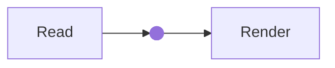

# Local diagrams and GitHub badges

Hugo 0.166.0; **Mermaid 11.17.2** and **drawio viewer 31.5.2**, pinned locally.
No Node/build browser, CDN renderer, editor service, upload, API key or Go plugin.
The normal specimen is `/handbook/reference/diagrams/` in the showcase.

## Mermaid stays a fence

````text

````

No page flag. The language-specific native code hook preserves ordinary code and
source-like examples. Supported rendering scope is **flowchart/graph and gitGraph**,
including the actual f-circ shape syntax, subgraphs, CJK labels and multi-target edges.
All 30 audited fences rendered in the local check; this is not every Mermaid grammar,
label/font combination or visual-parity certification. Ordinary B math remains separate.

Optional fence attributes: plain nonblank `title`, safe `class`/`id`, `disabled=true`
or `false`. Disabled means visible source without renderer resources. Do not pass
highlighter options to this diagram hook. Init directives/YAML configuration and other
diagram grammars are rejected by the bounded renderer; use source-only or a separately
reviewed integration rather than enabling trusted source. Limit: 50,000 characters,
500 edges. Raw source is escaped in a native details/pre fallback, never host HTML/JS.

## Native drawio source

```text


```

Named `src` is required; optional plain `title` and boolean `disabled`. Only exact
current-page `.drawio` resources: no absolute/parent/dot/encoded/glob paths, URLs,
static/global fallback or arbitrary filesystem access. Missing files/invalid options
fail with shortcode position. Native RelPermalink and full original bytes supply the
source download under dated/base-path/language/mounted-doc routes. Files are never
changed, uploaded or replaced by their rendered image. Resource publication is not
redaction; disabling rendering does not make a bundle file private.

The current renderer covers **one uncompressed mxfile page**, up to 1 MB / 2,500 cells,
finite geometry coordinates/dimensions within ±100,000. This matches all 40 stored
sources, which rendered in the local check. Native tables/rows/partial rectangles,
arrows, brackets, waypoints and the needed basic polygon stencil stay available.
No external images/fonts, custom executable stencils, drawio math, compressed pages,
multiple-page/layer UI or arbitrary stencil library downloads are promised. These
unsupported inputs fail to source fallback; they are not silently converted to boxes.

**Viewing:** local SVG image, zoom in/out/fit, keyboard arrow-key panning, native touch scrolling and mouse
panning. Expand view increases the scrollport height; it is not a hosted lightbox or
full editor. This is a source-driven viewer, not a claim to preserve unused upstream
editing/tooltip/layer features. **Editing:** download the original and edit in your
chosen local diagrams.net application. No online editor button or automatic XML transfer.

## Safety, loading and composition

One lazily created opaque sandbox per renderer **per page**, with a serialized render
queue, avoids a library instance for every diagram. A diagram is queued near the
viewport; a closed fold does not render until visible. The sandbox has only
`allow-scripts`, no same-origin privilege, popups, navigation or download permission.
Its own CSP denies connections, external images/fonts, child frames and eval. drawio
stencil evaluation/dynamic loading and its otherwise automatic MathJax bootstrap are
explicitly disabled. Mermaid uses strict sanitization and fixed integration settings.

Only source-window-checked messages reach the owned sandbox. Returned SVG is displayed
as an **inert Blob-backed image**, never inserted as HTML into the article. Source,
caption, download and control labels remain native parent HTML. The images expose their
authored alternative labels; this is not a screen-reader graph navigator. Supply useful
prose descriptions/titles for meaningful diagrams; source is always available.

Both palettes and System changes work. An author-marked `invert-when-dark` or
`invert-when-light` ancestor selects a **fixed light renderer palette**: the existing
B filter alone performs that authored inversion. Diagram captions/controls/source chrome
use paired light colors inside that wrapper too, avoiding double-themed unreadable text.
Explicit nested filters still compound.
Unmarked diagrams are renderer-themed, not automatically CSS-inverted. No image analysis.

Use C2 **outer `%`, nested `<`** containers. Mermaid fences need no shortcode notation;
diagramsnet and badge_github are block leaves on their own lines. Existing page-local
trusted-node restoration and one-pass Markdown/math/snippet rendering remain. Native
keys now permit underscore-separated shortcode names for badge_github, without dropping
missing/forged-key checks. Site overrides retain their documented bridge obligations.

The shared shell detects actual rendered Content/HTML Summary before deferred resources.
Plainified card excerpts, plain pages, literal code and disabled-only pages request no
diagram libraries. Custom layouts must preserve that shell integration. Libraries and
frames are fingerprinted; manifests validate bundled bytes before publication. Opaque
frames cannot use script SRI without CORS-enabled hosting, so **build-time hashes plus
fingerprinted URLs** are used inside them—not weakened sandbox permissions or a new
server-header prerequisite. The parent controller still has SRI. Frame CSP permits
local scripts and inline vendor styles only; a site CSP must allow its local frames
and Blob images. No global unsafe HTML or unsafe-eval is enabled.

Visible states: source-only/no-JS, loading, ready, disabled and error. Failed input does
not poison a later diagram. Missing libraries or a 15-second wait show source fallback;
there is no retry daemon. A stalled third-party renderer is not a universal browser-DoS
sandbox guarantee. Source fallback is **not equivalent visual rendering**. Local assets
are needed on the initial visit; there is no service worker/offline-cache promise.

## Automatic GitHub badges

```text

```

Required named string `user`/`repo`; optional string `branch`, booleans `release=false`
and `disabled=false`. Quote numeric account names, e.g. `user="78"`. Names and branch
segments are validated; branch paths and identity query data are URL-encoded, never
interpolated as HTML or executable URLs. Unknown fields/types fail with source position.

Four images: identity, stars, forks, last commit. `release=true` adds latest release
and release date. Branch affects the identity label and last-commit path only. The
repository link remains the repository root, matching actual source behavior. Existing
C2 link cards are unchanged; no metadata preview fetch or GitHub API/backend is added.

**User-approved automatic loading:** native lazy images contact **img.shields.io**
without a consent button. No referrer is sent by those image elements; Shields still
receives visitor IP and requested repository/branch. No snapshots, stored counts,
polling, token or retries. Scripted loading/ready/error messages use native EN/ZH keys;
failed images become labeled unavailable values, and the repo link remains. A visible
load that waits 15 seconds gets that fallback; late image success can recover. No-JS
still has ordinary image/alt behavior and the repo link. Disabled means no images.
Image success proves delivery, **not freshness, accuracy or the absence of an error
message inside the provider's SVG**. Provider reliability is not theme acceptance.

## Conversion and verification

- Mermaid fences unchanged; old flags unnecessary. B colon inversion wrappers still
  become the approved general block, not a new diagram-only syntax.
- `` → ``.
- `` → named arguments above.
- No real-site source migration, retired image viewer/emoji/timeline restoration,
  AnimCube, backlinks/search/comments or full editor is included.

`tests/check_diagrams.py` uses one tiny source tree and the active theme, caps Hugo to
two workers and reuses a cache/output for expected failures. It also checks the real
root's opt-in docs contract. `check_diagram_preview.py` uses that tree and an explicitly
free port, stopping its own server. `check_diagrams_browser.mjs` uses the existing
isolated harness, mocks all Shields requests, checks the 30/40 actual diagram sources
in memory only, and captures only synthetic examples. See the coordination P3-D report
for actual commands/results and deliberately unrun broad/cross-browser checks.
