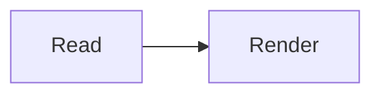

These are optional content interfaces with distinct loading and privacy behavior.
Literal examples here do not activate a renderer/provider. The
[shortcode reference](../publishing/shortcodes.md#media-and-badges) owns their arguments.

## Mermaid

````text

````

Use a native `mermaid` fence, or a `text` fence for source only. Supported grammar is
flowchart/graph and gitGraph; not every Mermaid dialect. Optional caption and safe
class/id are accepted, not init directives, YAML config, title/disabled aliases or
highlighter options. Limits are 50,000 characters and 500 edges. Fixed strict
configuration uses native SVG labels; no author-supplied HTML-label configuration.

## diagrams.net

```text

```

Only an exact current-bundle `.drawio` resource: one uncompressed mxfile page, up to
1 MB and 2,500 cells, finite geometry within ±100,000. No compressed/multipage UI,
external images/fonts, executable stencils, math or arbitrary stencil downloads.
Unsupported input retains an error/source-download fallback, not guessed boxes.
Download original bytes and edit with a local application; nothing uploads XML.

Both diagram renderers are pinned local vendor assets. Near-viewport rendering uses
one opaque sandbox per renderer/page, fixed network/eval restrictions and source-window
message checks. Returned SVG is an inert Blob-backed image, not host-page HTML.
Captions/prose provide meaning for assistive technology; SVG text is not selectable.
Unmarked diagrams adapt palettes; explicitly inverted parents use a fixed light
renderer palette to avoid double inversion. Native zoom/fit/pan and modal controls
preserve keyboard/focus behavior. No-JS/error keeps Mermaid source or drawio download,
not equivalent visual rendering. Custom CSP must allow local frames and Blob images.

## MP4

```text

```

Exact current-bundle or authored HTTP(S) MP4 only. **Load video** attaches its source;
playback then uses native controls, without autoplay, build-time fetch or a player
library. No initial remote media request; activation contacts the authored host.
Codec/browser/range delivery matters. Supply a transcript for meaningful audio;
this bounded component has no track authoring API. No-JS/disabled/error retains a
real file link; hiding playback does not make its resource private.

## GitHub badges

```text

```

Enabled badges use automatic native lazy images from **img.shields.io**: identity,
stars, forks, last commit, plus release/release date when requested. No build-time
GitHub API/token, snapshot or polling. Browser requests disclose IP and repository/
branch to Shields, with no image referrer. `disabled=true` keeps the repository link
without images. Delivery is not proof of freshness or accuracy. Use a plain link if
you do not want that request policy. The example above remains escaped text.
